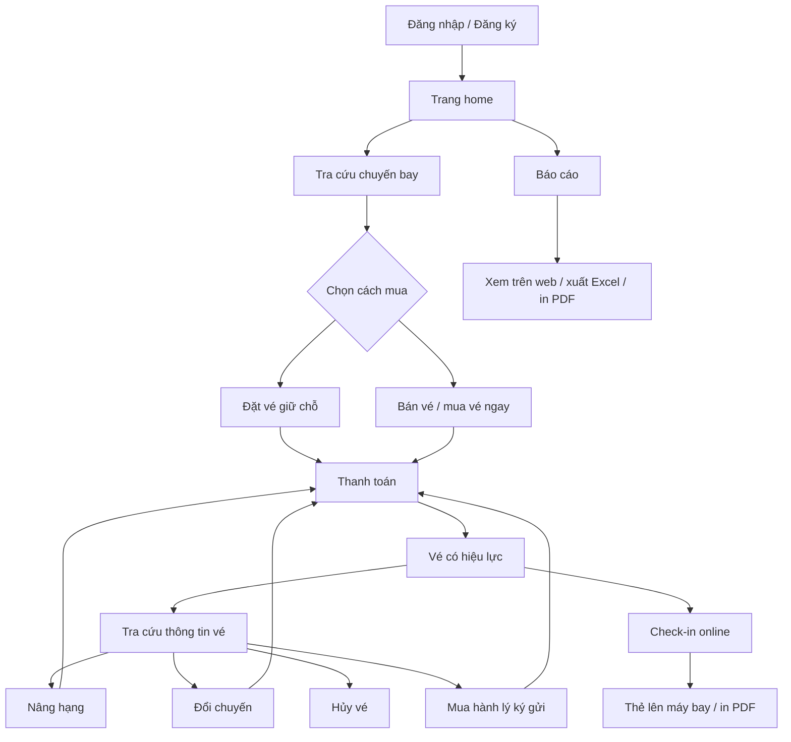

# Kế hoạch UI frontend cho hệ thống quản lý bán vé máy bay

Tài liệu này dùng cho agent frontend đọc để hiểu nghiệp vụ và dựng giao diện. Backend đã có sẵn, vì vậy tài liệu chỉ dùng nhãn nghiệp vụ bằng tiếng Việt, không đặt lại tên biến hoặc tên trường kỹ thuật. Các giới hạn, tỷ lệ, thời điểm mở/đóng nghiệp vụ, phí, ngưỡng cảnh báo... lấy từ `THAMSO_docs.md` hoặc API tham số tương ứng.

## 1. Cách hiểu hệ thống theo thực tế

Hệ thống bán vé máy bay nên được nhìn như một chuỗi nghiệp vụ liên tục:

1. Khách hàng đăng ký hoặc nhân viên tạo hồ sơ khách hàng.
2. Nhân viên lập lịch chuyến bay, gồm tuyến bay, giờ bay, giá cơ sở, số ghế từng hạng và sân bay trung gian nếu có.
3. Người dùng tra cứu chuyến bay còn chỗ.
4. Người dùng đặt chỗ trước hoặc mua vé ngay.
5. Đặt chỗ chỉ giữ chỗ trong thời hạn hợp lệ; vé có hiệu lực sau khi thanh toán đủ.
6. Sau khi có vé, khách có thể phát sinh dịch vụ: nâng hạng, đổi chuyến cùng tuyến, hủy vé, mua hành lý ký gửi.
7. Thanh toán tạo hóa đơn cho vé hoặc dịch vụ phát sinh.
8. Check-in online chỉ mở khi vé hợp lệ, đã thanh toán và nằm trong khung giờ cho phép.
9. Báo cáo doanh thu tổng hợp từ vé/dịch vụ hợp lệ theo quy định backend.

Trong thực tế, các hệ thống đặt vé thường tách "đặt chỗ" và "vé đã xuất". Đặt chỗ giữ thông tin hành trình và ghế trong một khoảng thời gian; vé là bằng chứng thanh toán và quyền đi chuyến bay. Luồng UI nên bám sát logic này để tránh nhầm giữa khách đã giữ chỗ và khách đã có vé.

## 2. Các nhóm dữ liệu nghiệp vụ trong biểu mẫu

### 2.1. Khách hàng

Nhóm này lưu hồ sơ hành khách/khách hàng.

Nội dung cần hiển thị:

- Mã khách hàng duy nhất do hệ thống cấp.
- Họ và tên.
- Số giấy tờ tùy thân.
- Số điện thoại.
- Email.
- Ngày sinh.
- Mã thành viên nếu khách có tham gia chương trình thành viên.
- Hạng thành viên.
- Điểm tích lũy.

Ý nghĩa trên UI:

- Đây là hồ sơ trung tâm để bán vé, đặt vé, thanh toán và tra cứu lịch sử.
- Hạng thành viên và điểm tích lũy là thông tin hệ thống tính/cập nhật; form tạo mới không nên cho nhập tay nếu backend đã tự động xử lý.
- Khi nhập số giấy tờ, điện thoại hoặc email đã tồn tại, UI nên gợi ý dùng hồ sơ cũ thay vì tạo trùng.

### 2.2. Lịch chuyến bay

Nhóm này lưu thông tin mở bán của một chuyến bay.

Nội dung cần hiển thị:

- Mã chuyến bay.
- Giá vé cơ sở.
- Sân bay đi.
- Sân bay đến.
- Ngày và giờ khởi hành.
- Thời gian bay.
- Số ghế hạng 1.
- Số ghế hạng 2.
- Danh sách sân bay trung gian, thời gian dừng và ghi chú.

Ý nghĩa trên UI:

- Đây là nơi quản trị chuyến bay và tồn ghế theo từng hạng vé.
- Giá từng hạng vé được tính từ giá cơ sở và tham số hệ thống.
- Sân bay trung gian là danh sách lặp; UI cần cho thêm, xóa, sắp xếp điểm dừng trong giới hạn tham số.
- Thời gian bay, số sân bay trung gian và thời gian dừng phải được kiểm tra theo tham số, nhưng không cần ghi cứng quy định trong giao diện.

### 2.3. Bán vé

Nhóm này tạo vé có hiệu lực khi còn ghế và thông tin khách hợp lệ.

Nội dung cần hiển thị:

- Chuyến bay.
- Hành khách.
- Số giấy tờ tùy thân.
- Điện thoại.
- Hạng vé.
- Giá tiền.

Ý nghĩa trên UI:

- Màn hình này phù hợp cho nhân viên quầy vé hoặc khách mua trực tiếp.
- Khi chọn chuyến bay và hạng vé, UI phải hiển thị ghế còn lại và giá tính được.
- Nếu hết ghế ở hạng đang chọn, nút bán vé bị khóa và hiển thị lý do ngắn gọn.
- Sau khi bán vé, hệ thống nên điều hướng sang thanh toán hoặc hóa đơn tùy luồng backend.

### 2.4. Ghi nhận đặt vé

Nhóm này tạo phiếu đặt chỗ trước khi thanh toán.

Nội dung cần hiển thị:

- Chuyến bay.
- Hành khách.
- Số giấy tờ tùy thân.
- Điện thoại.
- Hạng vé.
- Giá tiền tạm tính.

Ý nghĩa trên UI:

- Đặt vé là trạng thái giữ chỗ có thời hạn.
- UI cần hiển thị hạn thanh toán/giữ chỗ được tính từ tham số.
- Nếu ngày khởi hành quá gần theo tham số, không cho tạo phiếu đặt và gợi ý mua vé trực tiếp nếu còn chỗ.
- Vào ngày khởi hành, phiếu đặt chưa thanh toán sẽ bị hủy hoặc hết hiệu lực theo backend; UI cần hiển thị trạng thái này trong danh sách.

### 2.5. Tra cứu thông tin vé

Nhóm này là màn hình đọc để khách/nhân viên biết vé đang ở trạng thái nào.

Nội dung cần hiển thị:

- Mã chuyến bay.
- Tên khách hàng.
- Sân bay đi.
- Sân bay đến.
- Ngày khởi hành.
- Trạng thái vé.

Ý nghĩa trên UI:

- Cho phép tìm theo số vé, tên khách hàng, số giấy tờ, điện thoại, chuyến bay hoặc ngày bay nếu backend hỗ trợ.
- Nếu vé đã hủy, hiển thị rõ trạng thái "Đã hủy".
- Nếu vé đã đổi chuyến, chi tiết vé phải hiển thị chuyến bay mới và lịch sử đổi.
- Đây là cửa vào chính cho các thao tác sau bán: nâng hạng, đổi chuyến, hủy vé, mua hành lý, thanh toán, check-in.

### 2.6. Nâng hạng ghế

Nhóm này ghi nhận phiếu nâng hạng cho một vé.

Nội dung cần hiển thị:

- Mã phiếu nâng hạng.
- Số vé.
- Hạng ghế cũ.
- Hạng ghế mới.
- Phí chênh lệch.
- Phí dịch vụ.
- Tổng tiền thu.
- Ngày thực hiện.

Ý nghĩa trên UI:

- Chỉ mở tác vụ khi chuyến bay còn ghế ở hạng cao hơn.
- Khi chọn hạng ghế mới, UI tự tính tổng tiền thu dựa trên giá hạng cũ, giá hạng mới và tham số phí dịch vụ.
- Sau khi xác nhận, ghế ở hạng cũ được trả lại và ghế ở hạng mới được giữ/bán theo logic backend.
- Luồng này nên đi kèm thanh toán nếu phát sinh tiền.

### 2.7. Đổi chuyến bay

Nhóm này ghi nhận phiếu đổi chuyến cho một vé.

Nội dung cần hiển thị:

- Mã phiếu đổi chuyến.
- Số vé.
- Chuyến bay cũ.
- Chuyến bay mới.
- Thời gian bay cũ.
- Thời gian bay mới.
- Phí đổi chuyến.
- Ngày thực hiện.

Ý nghĩa trên UI:

- Chuyến mới phải cùng tuyến với chuyến cũ theo backend/tham số.
- UI chỉ liệt kê các chuyến bay mới còn ghế trong cùng tuyến và còn nằm trong thời hạn được đổi.
- Nếu không có chuyến phù hợp, hiển thị empty state với lý do: hết ghế, không cùng tuyến, quá hạn đổi hoặc vé không hợp lệ.
- Sau đổi chuyến, trang chi tiết vé phải hiển thị chuyến bay hiện tại và lịch sử thay đổi.

### 2.8. Hủy vé

Nhóm này ghi nhận phiếu hủy vé.

Nội dung cần hiển thị:

- Mã phiếu hủy.
- Số vé.
- Ngày hủy.
- Lý do hủy.
- Phí hủy vé.
- Số tiền hoàn lại.
- Trạng thái vé sau khi hủy.

Ý nghĩa trên UI:

- Nút hủy chỉ cho bấm khi vé còn được hủy theo tham số thời gian.
- UI phải hiển thị trước số tiền dự kiến hoàn lại và phí hủy để người dùng xác nhận.
- Sau khi hủy thành công, ghế trên chuyến bay trở thành trống; trạng thái vé cập nhật ngay trong tra cứu.
- Lý do hủy nên là ô nhập nhiều dòng ngắn, có thể kèm các lý do gợi ý.

### 2.9. Thanh toán

Nhóm này tạo hóa đơn cho vé, phiếu đặt chỗ hoặc dịch vụ phát sinh.

Nội dung cần hiển thị:

- Mã hóa đơn.
- Ngày lập.
- Khách hàng.
- Vé hoặc phiếu đặt chỗ liên quan.
- Giá trước thuế/phí.
- Giá sau thuế/phí.
- Hình thức thanh toán.

Ý nghĩa trên UI:

- Thanh toán là bước chuyển đặt chỗ thành vé có hiệu lực, hoặc hoàn tất dịch vụ phát sinh.
- UI cần hiển thị rõ nguồn thu: tiền vé, phí đổi/nâng hạng, hành lý ký gửi, phụ phí nếu có.
- Sau khi thanh toán thành công, hiển thị màn hình kết quả có nút xem vé, in hóa đơn, gửi email nếu backend hỗ trợ.
- Nếu thanh toán thất bại hoặc chưa đủ, vé/dịch vụ liên quan không nên hiển thị như đã hoàn tất.

### 2.10. Hành lý ký gửi

Nhóm này ghi nhận các kiện hành lý gắn với vé.

Nội dung cần hiển thị:

- Số vé.
- Họ tên hành khách.
- Chuyến bay.
- Danh sách kiện hành lý.
- Thứ tự kiện.
- Mã hành lý.
- Thời điểm mua.
- Trọng lượng từng kiện.

Ý nghĩa trên UI:

- Mỗi vé có thể có nhiều kiện hành lý.
- UI cần tính giá theo thời điểm mua: mua trước hay mua tại sân bay, dựa vào tham số.
- Nếu một kiện vượt giới hạn trọng lượng, UI gợi ý tách kiện và không cho lưu đến khi hợp lệ.
- Nếu tổng tải trọng dự kiến của chuyến bay đạt ngưỡng an toàn, nút thêm hành lý bị khóa và hiển thị lý do.
- Hành lý là dịch vụ phát sinh, nên sau khi ghi nhận cần đi qua thanh toán nếu có thu phí.

### 2.11. Tra cứu chuyến bay

Nhóm này là danh sách tra cứu/chọn chuyến bay cho người dùng.

Nội dung cần hiển thị:

- Số thứ tự.
- Sân bay đi.
- Sân bay đến.
- Giờ khởi hành.
- Thời gian bay.
- Số ghế trống.
- Số ghế đã đặt/đã bán.

Ý nghĩa trên UI:

- Đây là danh sách dùng chung cho home, bán vé, đặt vé và đổi chuyến.
- Các số ghế trống/đã đặt phải cập nhật sau mỗi thao tác.
- Nên có bộ lọc theo sân bay đi, sân bay đến, ngày bay, khoảng giờ và tình trạng còn chỗ.
- Khi bấm vào một dòng, mở chi tiết chuyến bay gồm giá vé, sức chứa từng hạng và sân bay trung gian.

### 2.12. Báo cáo

Nhóm này gồm hai dạng báo cáo doanh thu.

Báo cáo theo tháng cần hiển thị:

- Tháng báo cáo.
- Tổng doanh thu.
- Danh sách chuyến bay trong tháng.
- Doanh thu từng chuyến.
- Số vé bán ra.
- Tỷ lệ doanh thu theo các hạng vé.
- Phụ phí/dịch vụ phát sinh.

Báo cáo theo năm cần hiển thị:

- Năm báo cáo.
- Tổng doanh thu.
- Danh sách từng tháng.
- Số chuyến bay.
- Số vé bán ra.
- Tỷ lệ doanh thu trên tổng năm.

Ý nghĩa trên UI:

- Báo cáo phải xem được trực tiếp trên web trước khi xuất file.
- Có nút xuất Excel theo đúng bộ lọc hiện tại.
- Có nút in/xuất PDF từ bản xem online, ưu tiên print stylesheet để giữ đúng bố cục báo cáo.
- Báo cáo chỉ tính các giao dịch/vé hợp lệ theo backend và quy định tham số; UI chỉ hiển thị chú thích "dữ liệu đã lọc theo quy định hiện hành".

### 2.13. Check-in online và thẻ lên máy bay

Nhóm này tạo màn hình kết xuất thẻ lên máy bay.

Nội dung cần hiển thị:

- Số vé.
- Họ tên hành khách.
- Hạng vé.
- Cổng check-in.
- Số thứ tự check-in.
- Số ghế.
- Ngày bay.
- Giờ check-in.
- Giờ cất cánh.
- Chuyến bay.
- Sân bay đầu.
- Sân bay đích.
- Danh sách sân bay trung gian, giờ hạ cánh và giờ cất cánh tại từng điểm.

Ý nghĩa trên UI:

- Check-in chỉ mở trong khung giờ từ tham số và đóng trước giờ khởi hành theo tham số.
- Nếu vé chưa thanh toán đủ, đã hủy, đã đổi nhưng chưa cập nhật hoặc nằm ngoài khung giờ, UI hiển thị lỗi nghiệp vụ rõ ràng và gợi ý quay lại tra cứu vé/thanh toán.
- Sau check-in thành công, hiển thị boarding pass online với nút in PDF/tải PDF.
- Boarding pass nên có layout riêng, không nằm trong dashboard dày đặc để khi in ra gọn và sạch.

## 3. Điều hướng tổng thể

### 3.1. Vai trò người dùng

Nếu backend có phân quyền, giao diện nên tách hai trải nghiệm:

- Khách hàng: đăng ký, đăng nhập, tìm chuyến bay, đặt vé/mua vé, xem vé, thanh toán, mua hành lý, check-in, in thẻ lên máy bay.
- Nhân viên/quản trị: quản lý khách hàng, lập lịch chuyến bay, bán vé/đặt vé hộ, xử lý thanh toán, đổi/nâng/hủy vé, quản lý hành lý, báo cáo.

Nếu backend chỉ có một loại tài khoản, vẫn giữ cấu trúc menu theo nhóm tác vụ để sau này dễ mở rộng quyền.

### 3.2. Sơ đồ luồng chính

### 3.3. Menu chính

- Tổng quan.
- Khách hàng.
- Chuyến bay.
- Bán vé và đặt vé.
- Tra cứu vé.
- Xử lý vé: nâng hạng, đổi chuyến, hủy vé.
- Thanh toán.
- Hành lý ký gửi.
- Check-in online.
- Báo cáo.

Menu nên dùng sidebar trên desktop và drawer hoặc bottom navigation trên mobile. Topbar luôn có ô tìm nhanh theo số vé, tên khách, số giấy tờ hoặc chuyến bay.

## 4. Bố cục và quy cách UI chung

### 4.1. Nguyên tắc giao diện

- Đây là web nghiệp vụ, ưu tiên mật độ thông tin cao, dễ quét, ít trang trí.
- Mỗi màn hình quản lý có ba vùng: thanh lọc/tìm kiếm, bảng danh sách, panel chi tiết hoặc form tạo/sửa.
- Các hành động nguy hiểm như hủy vé, hủy đặt chỗ, xác nhận đổi chuyến cần modal xác nhận có tóm tắt tác động tài chính.
- Giá trị tiền tệ canh phải, có phân cách hàng nghìn và đơn vị tiền thống nhất.
- Trạng thái nên dùng badge ngắn: còn chỗ, hết chỗ, đã đặt, đã thanh toán, đã hủy, đã check-in, quá hạn.
- Form dài chia thành section rõ ràng, không dồn tất cả vào một cột.
- Trên mobile, bảng dữ liệu chuyển thành card có các thông tin chính và nút hành động rõ.

### 4.2. Thành phần dùng lặp lại

- Bảng dữ liệu có sort, filter, pagination và chọn cột hiển thị.
- Drawer/form bên phải để tạo mới hoặc cập nhật nhanh.
- Detail page cho khách hàng, chuyến bay, vé và hóa đơn.
- Timeline lịch sử cho vé: đặt chỗ, thanh toán, bán vé, đổi chuyến, nâng hạng, hủy, check-in, hành lý.
- Price summary cố định ở cạnh phải trong các flow có tiền.
- Empty state có lý do và hành động tiếp theo.
- Error banner phân biệt lỗi nhập liệu, lỗi hết ghế do người khác vừa mua, lỗi quá hạn tham số và lỗi hệ thống.

## 5. Màn hình chi tiết

### 5.1. Đăng ký

Mục tiêu: tạo tài khoản và hồ sơ khách hàng.

Trường hiển thị:

- Họ và tên.
- Số giấy tờ tùy thân.
- Số điện thoại.
- Email.
- Ngày sinh.
- Thông tin đăng nhập theo backend hiện có.

Bố cục:

- Một form trung tâm, rộng vừa phải.
- Chia thành hai nhóm: "Thông tin cá nhân" và "Thông tin đăng nhập".
- Sau khi đăng ký thành công, hiển thị mã khách hàng được cấp và đưa về trang home/hồ sơ.

Trạng thái cần có:

- Đang kiểm tra trùng lặp số giấy tờ/email/điện thoại.
- Tạo thành công.
- Bị trùng hồ sơ, gợi ý đăng nhập hoặc khôi phục mật khẩu.

### 5.2. Đăng nhập

Mục tiêu: vào đúng không gian làm việc.

Trường hiển thị:

- Email/điện thoại/tài khoản.
- Mật khẩu.

Bố cục:

- Form gọn, có liên kết đăng ký và quên mật khẩu nếu backend hỗ trợ.
- Sau đăng nhập, điều hướng theo vai trò: khách hàng vào home cá nhân, nhân viên vào dashboard vận hành.

### 5.3. Trang home

Mục tiêu: là cửa vào nhanh cho các tác vụ hay dùng.

Với khách hàng:

- Thanh tìm chuyến bay: sân bay đi, sân bay đến, ngày bay, hạng vé mong muốn.
- Khu "Chuyến bay sắp tới" hiển thị vé/đặt chỗ gần nhất.
- Nút nhanh: tra cứu vé, thanh toán đặt chỗ, mua hành lý, check-in online.
- Cảnh báo: đặt chỗ sắp hết hạn, check-in đã mở, vé chưa thanh toán.

Với nhân viên:

- Ô tìm nhanh toàn cục.
- KPI trong ngày: số vé bán, phiếu đặt chỗ chưa thanh toán, chuyến bay sắp khởi hành, doanh thu tạm tính.
- Bảng chuyến bay sắp khởi hành với số ghế trống/đã đặt.
- Hàng tác vụ cần xử lý: đặt chỗ sắp hết hạn, thanh toán chờ xử lý, hành lý bị khóa do ngưỡng tải trọng, check-in lỗi.

Bố cục:

- Desktop: topbar + sidebar + vùng nội dung 12 cột.
- Mobile: topbar có search, tác vụ nhanh thành card nhỏ, bảng chuyển thành list.

### 5.4. Quản lý khách hàng

Danh sách:

- Cột chính: mã khách hàng, họ tên, số giấy tờ, điện thoại, email, hạng thành viên, điểm tích lũy.
- Bộ lọc: tên, số giấy tờ, điện thoại, email, hạng thành viên.
- Hành động: xem chi tiết, sửa thông tin liên hệ, tạo vé/đặt vé cho khách.

Chi tiết:

- Thông tin cá nhân ở đầu trang.
- Thẻ thông tin thành viên: hạng, điểm, mã thành viên.
- Lịch sử liên quan: đặt chỗ, vé, hóa đơn, hành lý, dịch vụ đổi/nâng/hủy.

Form tạo/sửa:

- Hai cột trên desktop: định danh cá nhân và liên hệ.
- Các trường hệ thống tự tính như hạng thành viên/điểm chỉ đọc.
- Sau khi lưu, hiển thị toast và cập nhật danh sách.

### 5.5. Quản lý lịch chuyến bay

Danh sách:

- Cột chính: mã chuyến bay, sân bay đi, sân bay đến, ngày giờ khởi hành, thời gian bay, giá cơ sở, ghế hạng 1, ghế hạng 2, ghế còn lại.
- Bộ lọc: sân bay đi, sân bay đến, ngày bay, còn chỗ/hết chỗ, có sân bay trung gian.
- Hành động: xem chi tiết, tạo lịch mới, sửa khi chưa phát sinh vé/đặt chỗ nếu backend cho phép.

Form lập lịch:

- Section 1: định danh chuyến bay và tuyến bay.
- Section 2: thời gian khởi hành và thời gian bay.
- Section 3: giá cơ sở và sức chứa từng hạng vé.
- Section 4: sân bay trung gian dạng bảng lặp.
- Panel phải: tóm tắt hợp lệ, cảnh báo theo tham số, giá hạng vé dự kiến.

Bảng sân bay trung gian:

- Mỗi dòng gồm sân bay dừng, thời gian dừng, ghi chú.
- Nút thêm dòng bị khóa khi đạt số lượng tối đa từ tham số.
- Nếu thời gian dừng ngoài khoảng cho phép, hiển thị lỗi ngay tại dòng.

Chi tiết chuyến bay:

- Header gồm tuyến bay, giờ khởi hành, tổng ghế trống.
- Tabs: tổng quan, ghế/giá, sân bay trung gian, vé/đặt chỗ liên quan, hành lý, doanh thu.

### 5.6. Tra cứu chuyến bay

Mục tiêu: tìm chuyến bay để mua, đặt hoặc đổi.

Bộ lọc:

- Sân bay đi.
- Sân bay đến.
- Ngày bay.
- Khoảng giờ.
- Hạng vé.
- Chỉ hiển thị chuyến còn chỗ.

Kết quả:

- Mỗi dòng/card hiển thị tuyến bay, giờ khởi hành, thời gian bay, giá từ mức cơ sở, ghế trống, ghế đã đặt.
- Mở rộng dòng để xem sân bay trung gian và số ghế theo từng hạng.
- CTA theo ngữ cảnh:
  - Từ home: đặt vé hoặc mua vé.
  - Từ đổi chuyến: chọn chuyến mới.
  - Từ quản trị: xem chi tiết.

Trạng thái:

- Hết chỗ: dòng bị làm mờ, không cho chọn để bán/đặt.
- Quá hạn đặt trước: ẩn nút đặt vé, chỉ giữ mua vé nếu backend cho.
- Không có chuyến: gợi ý đổi ngày hoặc đổi sân bay.

### 5.7. Bán vé / mua vé ngay

Luồng đề xuất:

1. Chọn chuyến bay.
2. Chọn hoặc tạo nhanh khách hàng.
3. Chọn hạng vé.
4. Xem giá tiền và ghế còn lại.
5. Xác nhận bán vé.
6. Tạo hóa đơn/thanh toán.
7. Hiển thị vé đã xuất.

Bố cục:

- Bên trái: form chọn chuyến và hành khách.
- Bên phải: tóm tắt vé, giá, hạng vé, số ghế còn.
- Dưới cùng: nút bán vé hoặc đi đến thanh toán.

Kiểm tra UI:

- Không cho bán nếu chuyến bay hết ghế ở hạng đã chọn.
- Khi số ghế thay đổi trong lúc nhập, cần reload lại khả dụng và hiển thị thông báo nếu không còn chỗ.
- Giá tiền là chỉ đọc sau khi chọn chuyến bay và hạng vé.
- Nếu khách hàng chưa có hồ sơ, mở drawer tạo nhanh với các trường tối thiểu.

### 5.8. Ghi nhận đặt vé

Luồng đề xuất:

1. Chọn chuyến bay còn chỗ.
2. Chọn hoặc tạo khách hàng.
3. Chọn hạng vé.
4. Xem giá tiền tạm tính và hạn thanh toán/giữ chỗ.
5. Xác nhận đặt vé.
6. Hiển thị phiếu đặt với nút thanh toán.

Bố cục:

- Giống bán vé, nhưng panel tóm tắt cần thêm hạn giữ chỗ.
- Danh sách đặt vé riêng có bộ lọc: còn hiệu lực, sắp hết hạn, đã thanh toán, đã hủy/hết hạn.

Trạng thái:

- Sắp hết hạn: badge vàng, hiển thị countdown nếu có thời gian chính xác.
- Hết hạn: badge xám/đỏ, ẩn nút thanh toán và hiển thị lý do.
- Ngày khởi hành: phiếu đặt bị hủy theo backend; UI phải refresh trạng thái khi mở chi tiết.

### 5.9. Tra cứu thông tin vé

Bộ lọc:

- Số vé.
- Tên khách hàng.
- Số giấy tờ.
- Điện thoại.
- Chuyến bay.
- Ngày khởi hành.
- Trạng thái vé.

Danh sách:

- Cột chính: số vé, khách hàng, chuyến bay, tuyến bay, ngày khởi hành, hạng vé, trạng thái.
- Hành động nhanh: xem chi tiết, thanh toán nếu chưa đủ, nâng hạng, đổi chuyến, hủy vé, mua hành lý, check-in nếu đủ điều kiện.

Chi tiết vé:

- Header: trạng thái vé, tên khách, chuyến bay hiện tại.
- Card hành trình: sân bay đi/đến, giờ khởi hành, thời gian bay, sân bay trung gian.
- Card giá/hóa đơn: giá vé, thanh toán liên quan.
- Card dịch vụ: nâng hạng, đổi chuyến, hủy, hành lý.
- Timeline lịch sử: mỗi sự kiện có ngày giờ và người thực hiện nếu backend có.

### 5.10. Nâng hạng ghế

Luồng đề xuất:

1. Mở từ chi tiết vé.
2. UI đọc hạng ghế hiện tại và danh sách hạng cao hơn còn ghế.
3. Chọn hạng mới.
4. Xem phí chênh lệch, phí dịch vụ, tổng tiền thu.
5. Xác nhận tạo phiếu nâng hạng.
6. Đi đến thanh toán nếu cần thu tiền.

Bố cục:

- Đầu trang: thông tin vé và chuyến bay.
- Giữa trang: so sánh hạng cũ/hạng mới.
- Bên phải: tổng kết phí.
- Dưới trang: lịch sử nâng hạng nếu có.

Trạng thái:

- Không có hạng cao hơn còn ghế: hiển thị thông báo và khóa nút.
- Vé đã hủy/đã bay/ngoài điều kiện: khóa form, hiển thị lý do.
- Sau khi xong: quay về chi tiết vé với hạng vé mới.

### 5.11. Đổi chuyến bay

Luồng đề xuất:

1. Mở từ chi tiết vé.
2. Hệ thống hiển thị chuyến bay cũ.
3. UI liệt kê các chuyến cùng tuyến còn ghế.
4. Chọn chuyến mới.
5. Xem thời gian mới và phí đổi.
6. Xác nhận đổi chuyến.
7. Đi đến thanh toán nếu có phí.

Bố cục:

- Bên trái: thông tin chuyến cũ.
- Bên phải: danh sách chuyến mới phù hợp.
- Panel tóm tắt: phí đổi, giờ cũ, giờ mới, hạng vé giữ nguyên.

Trạng thái:

- Quá hạn đổi: khóa nút và hiển thị mốc thời gian theo tham số.
- Không cùng tuyến: không hiển thị trong danh sách.
- Chuyến mới hết ghế: dòng bị vô hiệu hóa.
- Sau khi đổi: vé hiển thị chuyến mới; chuyến cũ nằm trong lịch sử.

### 5.12. Hủy vé

Luồng đề xuất:

1. Mở từ chi tiết vé.
2. Bấm hủy vé.
3. Modal hiển thị thông tin vé, phí hủy, số tiền hoàn lại.
4. Nhập lý do hủy.
5. Xác nhận.
6. Hiển thị phiếu hủy và trạng thái vé đã hủy.

Bố cục:

- Không nên làm thành page dài nếu tác vụ đơn; modal là đủ.
- Nếu cần quản lý nhiều phiếu hủy, có danh sách riêng trong module xử lý vé.

Trạng thái:

- Vé không đủ điều kiện hủy: ẩn/khóa nút hủy, hiển thị lý do.
- Vé đã check-in: backend quyết định; UI hiển thị lỗi nghiệp vụ nếu không cho.
- Sau hủy thành công, tất cả CTA mua hành lý/check-in/đổi/nâng bị khóa.

### 5.13. Thanh toán và hóa đơn

Luồng đề xuất:

1. Vào từ phiếu đặt, vé vừa bán, nâng hạng, đổi chuyến hoặc hành lý.
2. Xem nguồn thanh toán và tổng tiền.
3. Chọn hình thức thanh toán.
4. Xác nhận thu tiền.
5. Hiển thị hóa đơn thành công.

Bố cục:

- Bên trái: thông tin khách hàng và mục cần thanh toán.
- Bên phải: tổng tiền trước thuế/phí, thuế/phí nếu backend trả về, tổng sau thuế/phí.
- Cuối trang: hình thức thanh toán và nút xác nhận.

Màn hình kết quả:

- Mã hóa đơn.
- Ngày lập.
- Trạng thái thanh toán.
- Nút xem vé/phiếu liên quan.
- Nút in hóa đơn/PDF.

Trạng thái:

- Thanh toán thiếu/thất bại: không cập nhật vé thành có hiệu lực.
- Đặt chỗ hết hạn trước khi thanh toán: dừng flow, hiển thị thông báo và cho quay lại tìm chuyến.
- Hóa đơn đã lập: không tạo trùng, hiển thị hóa đơn hiện có.

### 5.14. Hành lý ký gửi

Luồng đề xuất:

1. Tra cứu vé.
2. Mở tab hành lý.
3. Thêm từng kiện hành lý.
4. Nhập trọng lượng và để hệ thống xác định thời điểm mua theo ngữ cảnh/thời gian hiện tại.
5. UI tính phí theo tham số.
6. Xác nhận và thanh toán.

Bố cục:

- Header: vé, khách hàng, chuyến bay.
- Bảng hành lý: thứ tự kiện, mã hành lý, thời điểm mua, trọng lượng, giá/phí nếu backend trả.
- Drawer thêm kiện: nhập trọng lượng, xem cảnh báo.
- Panel tổng kết: tổng số kiện, tổng trọng lượng, tổng phí, trạng thái ngưỡng tải trọng chuyến bay.

Trạng thái:

- Vượt giới hạn một kiện: hiển thị lỗi và gợi ý tách thành nhiều kiện.
- Vượt số kiện tối đa nếu tham số có: khóa nút thêm.
- Chuyến bay đạt ngưỡng tải trọng: khóa bán thêm hành lý.
- Chưa thanh toán: hành lý hiển thị trạng thái chờ thanh toán.

### 5.15. Báo cáo doanh thu

Màn hình báo cáo nên có tabs:

- Theo tháng.
- Theo năm.

Bộ lọc:

- Tháng/năm.
- Tùy chọn chi tiết theo chuyến bay nếu backend hỗ trợ.

Báo cáo theo tháng:

- Đầu trang: tháng báo cáo, tổng doanh thu, tổng vé bán, tổng phụ phí.
- Bảng: chuyến bay, doanh thu, số vé bán ra, tỷ lệ doanh thu theo hạng vé, phụ phí.
- Biểu đồ gợi ý: cột doanh thu theo chuyến bay, donut tỷ trọng theo hạng vé.

Báo cáo theo năm:

- Đầu trang: năm báo cáo, tổng doanh thu, tổng vé bán, tổng chuyến bay.
- Bảng: tháng, số chuyến bay, số vé bán ra, tỷ lệ trên tổng doanh thu.
- Biểu đồ gợi ý: line/bar doanh thu theo tháng.

Xuất file:

- Nút "Xuất Excel" xuất đúng dữ liệu theo bộ lọc hiện tại.
- Nút "In PDF" dùng bản xem online với print stylesheet.
- Trước khi xuất, UI nên hiển thị thời điểm tạo báo cáo và bộ lọc đang áp dụng.
- Khi dữ liệu rỗng, vẫn có thể xuất mẫu báo cáo rỗng nếu backend hỗ trợ, nhưng cần hiển thị cảnh báo.

### 5.16. Check-in online và boarding pass

Luồng đề xuất:

1. Người dùng vào check-in online từ home hoặc chi tiết vé.
2. Nhập/lấy số vé và thông tin xác minh theo backend.
3. UI kiểm tra điều kiện: vé hợp lệ, đã thanh toán, nằm trong khung giờ, chưa bị hủy.
4. Nếu hợp lệ, hiển thị thông tin chuyến bay và nút check-in.
5. Sau check-in, hiển thị thẻ lên máy bay.
6. Cho in PDF/tải PDF.

Bố cục check-in:

- Form tìm vé ở đầu trang.
- Card trạng thái check-in: chưa mở, đang mở, đã đóng, không đủ điều kiện.
- Khi đang mở: hiển thị nút check-in chính và thông tin giờ cất cánh.

Bố cục boarding pass:

- Trang riêng, tối ưu cho in A4 hoặc kích thước boarding pass.
- Vùng đầu: tên hành khách, chuyến bay, sân bay đi/đến, ngày giờ.
- Vùng giữa: hạng vé, cổng check-in, số thứ tự check-in, số ghế.
- Vùng dưới: sân bay trung gian nếu có.
- Nút trên web: in PDF, quay lại chi tiết vé.

Trạng thái lỗi:

- Chưa đến giờ: hiển thị thời điểm có thể check-in.
- Đã qua giờ: yêu cầu làm thủ tục tại quầy.
- Vé chưa thanh toán: hiển thị nút đi đến thanh toán.
- Vé đã hủy: chỉ hiển thị trạng thái, không cho check-in.

## 6. Tham số và cách UI phản ứng

Không lặp lại nội dung quy định trong UI. Frontend chỉ cần đọc giá trị hiện hành và phản ứng:

- Số lượng sân bay và danh sách sân bay: điều khiển dropdown, tìm sân bay, validation lập lịch.
- Thời gian bay tối thiểu: báo lỗi khi lập lịch nếu thời gian bay không đạt.
- Số sân bay trung gian tối đa: khóa nút thêm điểm dừng khi đạt ngưỡng.
- Khoảng thời gian dừng: báo lỗi trên dòng sân bay trung gian.
- Tỷ lệ giá theo hạng vé: tính giá khi bán/đặt/nâng hạng.
- Hạn đặt vé trước khởi hành: khóa flow đặt vé khi quá hạn.
- Thời điểm hủy đặt tự động: hiển thị trạng thái hết hiệu lực/sắp hết hạn.
- Hạn đổi chuyến/hủy vé: khóa CTA đổi/hủy và hiển thị lý do.
- Phí nâng hạng, phí đổi, phí hủy, thuế/phí: hiển thị trong price summary.
- Giới hạn hành lý từng kiện, số kiện tối đa, giá mua trước/tại sân bay, ngưỡng tải trọng chuyến bay: khóa/gợi ý trong module hành lý.
- Khung giờ check-in và thời điểm đóng check-in: điều khiển trạng thái check-in.
- Điều kiện tính báo cáo: hiển thị chú thích và chỉ xuất dữ liệu backend đã tính hợp lệ.

## 7. Trạng thái và thông báo cần thống nhất

### 7.1. Trạng thái vé/đặt chỗ

- Mới tạo.
- Chờ thanh toán.
- Đã thanh toán.
- Có hiệu lực.
- Đã hủy.
- Hết hạn.
- Đã đổi chuyến.
- Đã nâng hạng.
- Đã check-in.

Không nhất thiết backend có đủ tất cả trạng thái riêng; UI có thể hiển thị trạng thái suy ra từ dữ liệu backend.

### 7.2. Thông báo lỗi nghiệp vụ

Thông báo nên ngắn, có lý do và hành động tiếp theo:

- "Chuyến bay này không còn ghế ở hạng đã chọn."
- "Đã quá thời hạn đặt vé trước chuyến bay."
- "Vé chưa thanh toán đủ, vui lòng thanh toán trước khi check-in."
- "Check-in online chưa mở. Vui lòng quay lại vào thời điểm được hiển thị."
- "Tổng tải trọng hành lý của chuyến bay đã đạt ngưỡng an toàn."
- "Không có chuyến bay cùng tuyến còn ghế để đổi."

### 7.3. Chống xung đột dữ liệu

Vì ghế và đặt chỗ có thể thay đổi nhanh:

- Mỗi lần xác nhận bán/đặt/đổi/nâng cần reload hoặc yêu cầu backend xác nhận lại tình trạng ghế.
- Nếu backend trả lời hết ghế, UI giữ lại form và để người dùng chọn hạng/chuyến khác.
- Các bảng danh sách cần refresh sau thao tác thành công.

## 8. Gợi ý điều hướng trang

Dùng tên route thân thiện, không phụ thuộc tên biến backend:

- Đăng nhập.
- Đăng ký.
- Tổng quan.
- Khách hàng.
- Chuyến bay.
- Tra cứu chuyến bay.
- Bán vé.
- Đặt vé.
- Vé.
- Chi tiết vé.
- Thanh toán.
- Hành lý.
- Check-in.
- Báo cáo.

Trong code, agent frontend nên tạo lớp adapter riêng để map nhãn UI sang field backend. Tài liệu này không nên được copy thành schema API.

## 9. Tiêu chí hoàn thành cho agent frontend

- Có đủ đăng ký, đăng nhập, home.
- Có sidebar/menu rõ theo nhóm nghiệp vụ.
- Mỗi bảng nghiệp vụ có danh sách, bộ lọc, chi tiết và form/hành động phù hợp.
- Bán vé và đặt vé đều kiểm tra còn ghế, giá và thời hạn theo tham số.
- Vé có trang chi tiết làm trung tâm cho đổi/nâng/hủy/hành lý/check-in.
- Thanh toán hiển thị đủ hóa đơn, tổng tiền, hình thức thanh toán và kết quả.
- Báo cáo xem được trên web, xuất Excel và in PDF.
- Boarding pass xem được online và in PDF.
- UI không hard-code quy định; đọc tham số và hiển thị trạng thái dựa trên tham số.
- Không dùng tên biến backend trong label hoặc tài liệu UI.

## 10. Nguồn tham khảo nghiệp vụ

- [Vietnam Airlines - Booking & Manage Booking](https://www.vietnamairlines.com/se/en/buy-tickets-other-products/booking-and-manage-bookings)
- [Vietnam Airlines - Online check-in](https://www.vietnamairlines.com/vn/en/travel-information/check-in/online-check-in?type=checkin)
- [Vietnam Airlines - Tra cứu thông tin vé và hành lý](https://enews.vietnamairlines.com/2021/04/baggage-information-inquiry-simple-and-convenient-feature/)
- [Amadeus for Developers - Flight booking flow, pricing, seatmap, baggage](https://developers.amadeus.com/self-service/apis-docs/guides/developer-guides/resources/flights/)
- [Bravo Passenger Solutions - Reservations, payment, e-ticketing](https://www.bravo.aero/reservations/)
- [Farel - Reservation system modules from booking to check-in/reporting](https://farel.io/platform/reservation-system/)
